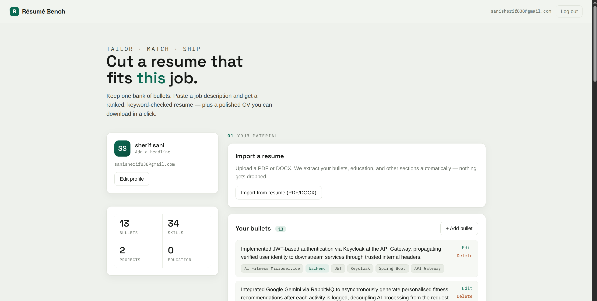
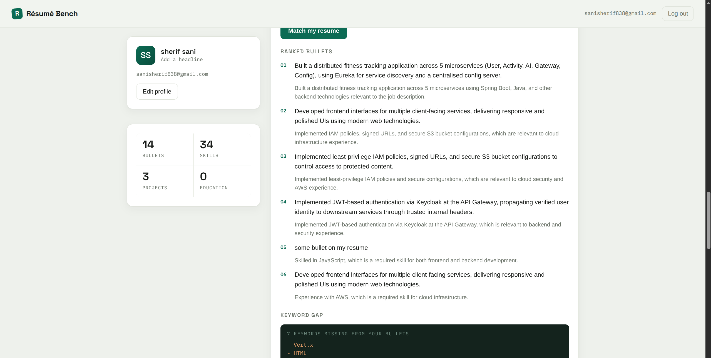
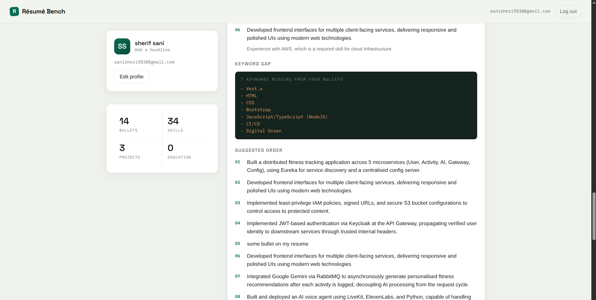
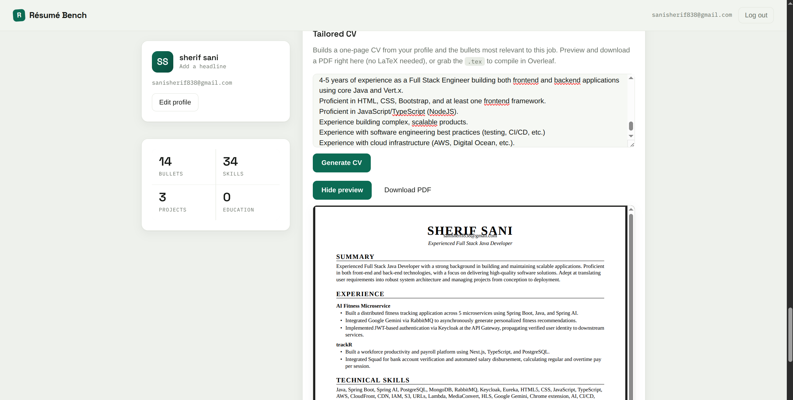

# Résumé Bench

**Tailor your resume to any job in seconds.** Keep one bank of resume bullets, paste a
job description, and get your bullets ranked by relevance, a keyword-gap analysis of the
terms you're missing, and a polished one-page CV you can preview and download as a PDF —
or export as LaTeX for Overleaf.

Built for the **AWS Builder Center — Weekend Productivity Challenge** (July 2026) on a
fully serverless AWS stack: **Lambda · API Gateway · DynamoDB · Amazon Bedrock (Nova
Lite) · S3**.

🔗 **Live app:** http://resume-tailor-887862869466.s3-website-us-east-1.amazonaws.com

---

## Screenshots

### The bench
Your profile and live stats on the left, your bullet bank on the right. A numbered
`01 → 02 → 03` workflow: add material, tailor to a job, generate a CV.



### Match & rank
Paste a real job description and your bullets are ranked by fit, each with a reason.



### The keyword gap (signature feature)
Tailoring a resume is a *diff* between what you've done and what the job asks for — so the
missing keywords are rendered like a code diff.



### Tailored CV, no LaTeX required
A one-page CV rendered as a real (vector, selectable) PDF right in the browser. Prefer
LaTeX? Copy the `.tex` or open it straight in Overleaf.



---

## Features

- **One bullet bank, many resumes** — store your accomplishments once, reuse everywhere.
- **Resume import (PDF/DOCX)** — upload an existing resume and it's parsed into structured
  bullets, plus your education, volunteering, and certifications — nothing gets dropped.
- **JD → ranked bullets** — an LLM ranks your bullets against a job description and explains
  each pick.
- **Keyword-gap analysis** — see exactly which terms from the JD are missing from your
  bullets before you apply.
- **Tailored CV generation** — a one-page CV, previewed and downloadable as a PDF, or
  exported as compile-safe LaTeX.
- **Multi-user with JWT auth** — each account only ever sees its own data.

---

## Architecture

```
┌──────────────┐      ┌──────────────┐      ┌───────────────────────┐
│  React (Vite) │ ───▶ │ API Gateway   │ ───▶ │ Lambda                │
│  on S3 static │      │ (REST)        │      │ FastAPI + Mangum      │
│  website      │ ◀─── │               │ ◀─── │                       │
└──────────────┘      └──────────────┘      └───────────┬───────────┘
                                                          │
                                        ┌─────────────────┼──────────────────┐
                                        ▼                                    ▼
                                ┌───────────────┐                 ┌────────────────────┐
                                │   DynamoDB     │                 │  Amazon Bedrock     │
                                │ Users +        │                 │  Nova Lite          │
                                │ ResumeBullets  │                 │  (parse/match/CV)   │
                                └───────────────┘                 └────────────────────┘
```

| Service | Role |
|---|---|
| **Amazon S3** | Hosts the built React app as a static website. |
| **Amazon API Gateway** | REST front door for the API. |
| **AWS Lambda** | One FastAPI app (via Mangum) serving all routes. |
| **Amazon DynamoDB** | Two on-demand tables: `Users` and `ResumeBullets` (partitioned by `user_id`). |
| **Amazon Bedrock (Nova Lite)** | Resume parsing, bullet↔JD matching, and CV content generation. |
| **AWS SAM / CloudFormation** | Infrastructure as code; one template, one deploy script. |
| **AWS Systems Manager (SSM)** | Stores the JWT signing secret as a SecureString. |

**Design decisions worth calling out:**
- **LaTeX never comes from the model.** The LLM returns *structured content only* (plain
  strings); a single module turns it into a compile-safe `.tex` document, escaping every
  user string so a stray `&` or `%` can't break the compile.
- **Factual sections are verbatim.** Education, certifications, and volunteering are stored
  on the user record and injected into the CV **unmodified** — never rephrased or dropped
  by the model.
- **Least-privilege IAM.** The Lambda role grants only specific DynamoDB actions on the two
  table ARNs, `bedrock:InvokeModel` on the Nova model, and read access to one SSM parameter.

---

## Tech stack

- **Frontend:** React 18 + Vite, `@react-pdf/renderer` (in-browser PDF), plain `fetch`.
- **Backend:** Python 3.12, FastAPI, Mangum, boto3, PyJWT + passlib (bcrypt), pypdf /
  python-docx for resume parsing.
- **Infra:** AWS SAM, CloudFormation, a single `deploy.sh`.

---

## Project structure

```
.
├── backend/
│   ├── app/
│   │   ├── main.py              # FastAPI app + Mangum handler
│   │   ├── auth.py              # signup/login/profile, JWT, get_current_user
│   │   ├── bullets.py           # bullet CRUD
│   │   ├── resume_import.py     # PDF/DOCX → bullets + education + sections
│   │   ├── match.py             # JD → ranked bullets + keyword gap
│   │   ├── cv.py                # JD → tailored CV content
│   │   ├── latex_template.py    # content → compile-safe LaTeX
│   │   ├── bedrock.py           # Bedrock Nova invoke + JSON parsing
│   │   ├── db.py / config.py / models.py
│   │   └── ...
│   ├── template.yaml            # SAM template (tables, Lambda, API, IAM)
│   └── scripts/create_tables.py # DynamoDB Local helper
├── frontend/
│   └── src/
│       ├── App.jsx
│       └── components/          # Dashboard, MatchForm, MatchResults, CVView, CVDocument, …
├── docs/screenshots/
├── deploy.sh                    # one-shot backend + frontend deploy
├── ARTICLE.md                   # Builder Center writeup
└── spec.md                      # original build spec
```

---

## API

| Method | Path | Auth | Purpose |
|---|---|---|---|
| POST | `/auth/signup` | – | Create user, returns JWT |
| POST | `/auth/login` | – | Returns JWT |
| GET/PUT | `/me` | ✔ | Read/update profile (name, contact, headline, education, sections) |
| GET/POST | `/bullets` | ✔ | List / add bullets |
| PUT/DELETE | `/bullets/{id}` | ✔ | Update / delete a bullet |
| POST | `/resume/import` | ✔ | Base64 PDF/DOCX → structured bullets + education + sections |
| POST | `/match` | ✔ | Rank bullets vs. a job description + keyword gap |
| POST | `/generate-cv` | ✔ | Tailored one-page CV (LaTeX + structured content) |
| GET | `/health` | – | Health check |

---

## Local development

```bash
cd backend
python3 -m venv .venv && . .venv/bin/activate
pip install -r requirements-dev.txt
cp .env.example .env                          # dev JWT secret + local DynamoDB endpoint

docker run -d --name ddb-local -p 8000:8000 amazon/dynamodb-local
python -m scripts.create_tables
uvicorn app.main:app --reload --port 8080
```

```bash
cd frontend
npm install
echo "VITE_API_BASE_URL=http://localhost:8080" > .env
npm run dev
```

`/match`, `/resume/import`, and `/generate-cv` make live Bedrock calls — those need AWS
credentials and a region where Nova Lite is enabled (e.g. `us-east-1`).

---

## Deploy

Prereqs: AWS credentials, the **SAM CLI**, and **Nova Lite model access** enabled in the
Bedrock console (region-specific).

```bash
./deploy.sh            # backend (SAM) + frontend (S3)
./deploy.sh backend    # backend only
./deploy.sh frontend   # rebuild + re-upload the frontend
```

The script creates the JWT secret in SSM if missing, builds and deploys the SAM stack,
reads the API URL from the stack outputs, builds the frontend against it, and syncs the
static site to S3. Defaults (region, stack name, bucket) are overridable via env vars.

---

## Cost

Everything is serverless and pay-per-use, so **idle cost is ~$0**. The only metered-from-
dollar-one service is Bedrock; at Nova Lite pricing a match or CV generation is roughly a
**tenth of a cent**, so a full weekend of testing costs pocket change. Tear down with
`sam delete --stack-name resume-tailor` and empty/delete the S3 bucket.

---

## License

MIT. The CV LaTeX template is adapted from Jake Gutierrez's resume template (MIT).
